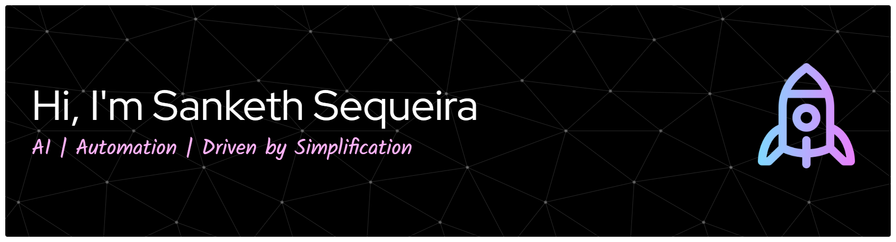

<!-- 🌠 COSMIC INTRO BANNER -->

  

 

🎓 Graduate Student at the **University of Illinois Chicago (MSCS)**  
💡 Passionate about **AI, automation, and secure software systems**  
🌍 Building meaningful tech that safeguards data, empowers people, and makes life simpler  

---

  

I’m a developer who enjoys blending **machine learning**, **data security**, and **software engineering** to create systems that are both intelligent and responsible.  
My work focuses on applying **AI and software solutions** to real-world problems that range from data protection to automation and prediction systems.  

---

  

### [DocBot](https://github.com/sanketh-1850/DocBot)  
An **LLM-powered developer assistant** designed to help programmers navigate complex documentation efficiently.  
- Uses **Retrieval-Augmented Generation (RAG)** to fetch relevant content from large documentation sets.  
- Integrates a **PostgreSQL relational database** for user, query, and document management.  
- Employs a **vector database (Pinecone)** to store embeddings of documentation chunks for accurate retrieval.  
- Aims to simplify the way developers interact with technical libraries like **Pandas**, **NumPy**, and others.  

---

  

### [DataGuard](https://github.com/sanketh-1850/DataGuard)  
A **Named Entity Recognition (NER)**–based application for **masking personal and medical information**, ensuring the secure handling of sensitive data.  
- Leverages **machine learning models** to identify and redact personal identifiers.  
- Designed for **privacy compliance**, helping developers handle confidential datasets safely.  
- Developed with **Python**, **Scikit-Learn**, and **NLP frameworks** for efficient entity recognition and masking.

---

  

**Languages:** C#, Java, Python, C++, C, MySQL, HTML, CSS  
**Libraries:** Pandas, NumPy, Matplotlib, Scikit-Learn, Keras  
**Developer Tools:** Git, GitHub, Unity 2D, Jira, VS Code, Eclipse, Google Colab  
**Core Skills & Technologies:** Data Structures, Algorithms, RESTful APIs  
**Soft Skills:** Problem Solving, Teamwork, Critical Thinking, Adaptability, Growth Mindset  

---

  

  

   &nbsp;&nbsp;&nbsp;
   &nbsp;&nbsp;&nbsp;
  

---

  

  
  &nbsp;&nbsp;&nbsp;
  

<!-- 🟩 Contribution Graph -->

  

